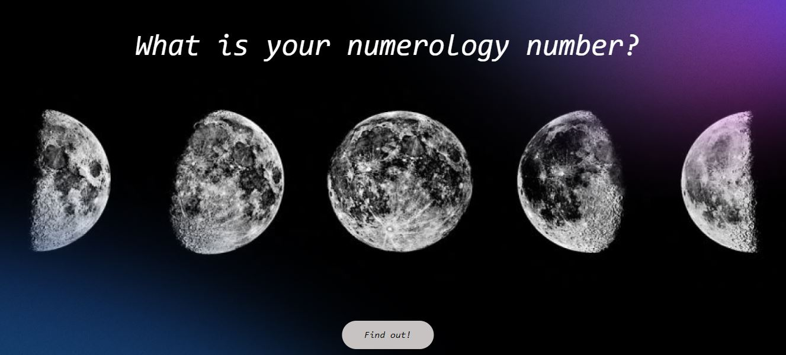
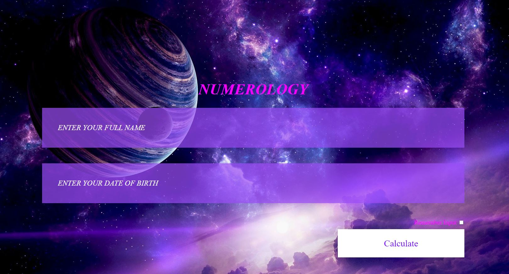
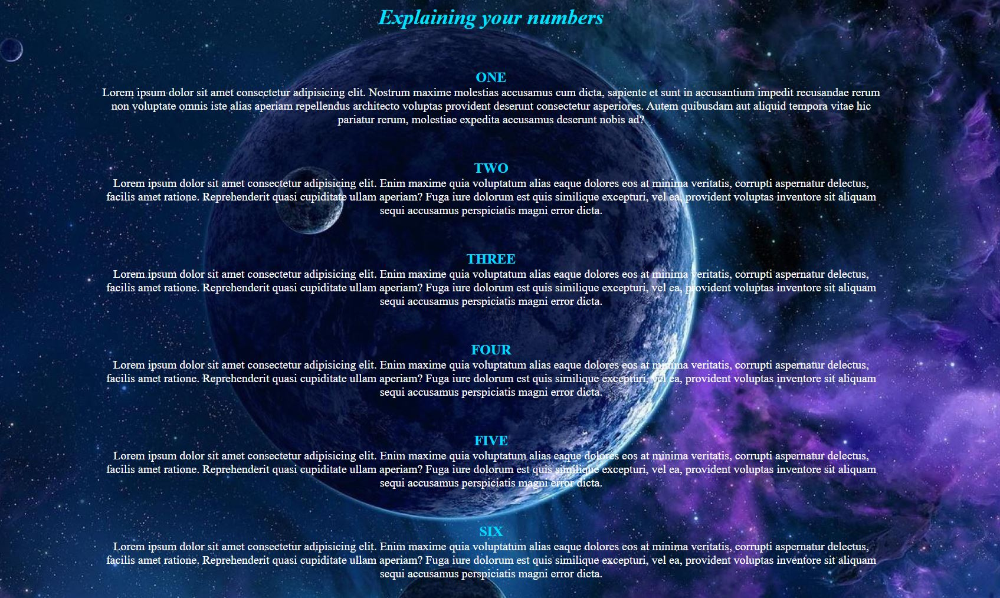
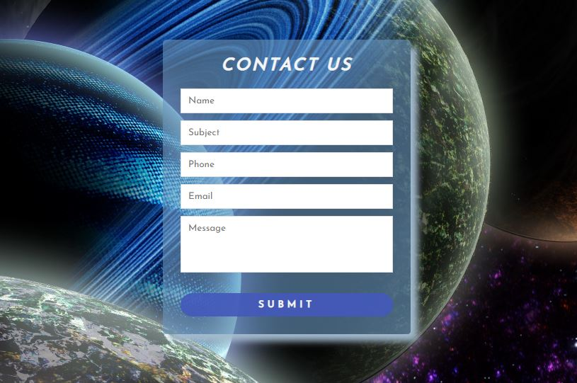

## Numerology

This project is for educational porpuses only.

[View_the_project](https://st-dev28.github.io/wgt_29-numerology/)

### project features

- responsive design
- css animations
- NodeJS
- localStorage

#### Authors

- [Sandra](https://github.com/ST-dev28)
- [Agnese](https://github.com/AgneseVilk)

#### screenshots

